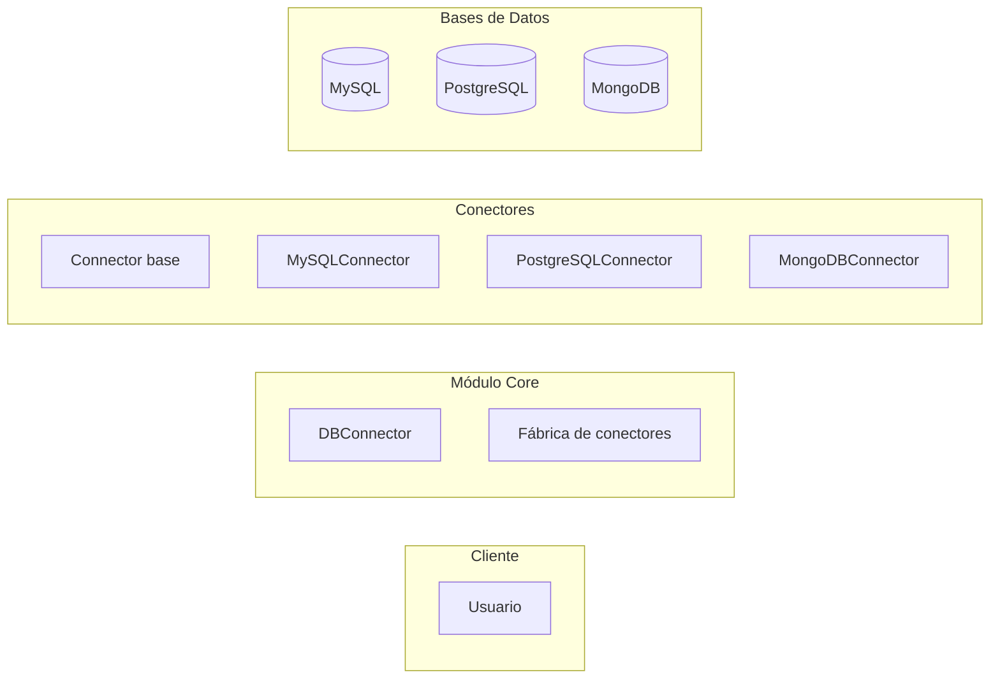

# Arquitectura

```mermaid
flowchart LR
  subgraph Cliente
    U[Usuario]
  end

  subgraph Módulo Core
    DC[DBConnector]
    FAC[Fábrica de conectores]
  end

  subgraph Conectores
    CBase[Connector base]
    CM[MySQLConnector]
    CP[PostgreSQLConnector]
    CMo[MongoDBConnector]
  end

  subgraph Bases de Datos
    DBM[(MySQL)]
    DBP[(PostgreSQL)]
    DBMo[(MongoDB)]
  end

```

# TODO: diagrama y explicación de la arquitectura
